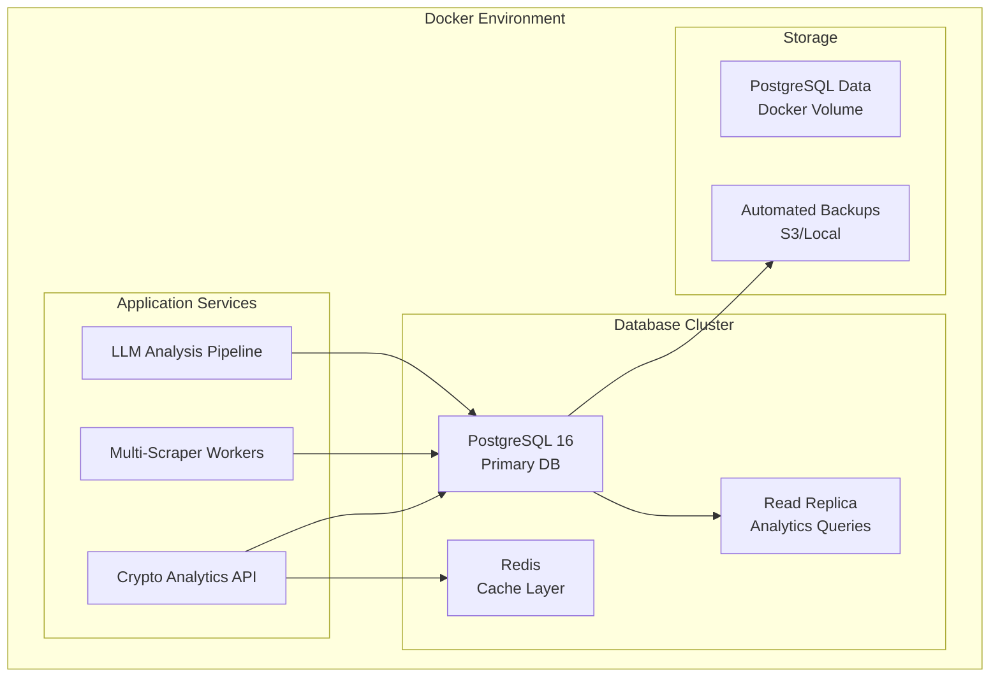

# Database Analysis & Upgrade Recommendations

## Current Database Analysis

### 📊 **Current State (SQLite)**

**Database Size & Scale:**
- **File Size**: 96.83 MB
- **Projects**: 51,375 crypto projects
- **Links**: 179,082 total links across 16 different types
- **Pending Analysis**: 175,974 links waiting for LLM processing  
- **Completed Analyses**: 1,617 link content analyses
- **Historical Changes**: 200,881 tracked changes
- **API Usage Records**: 2,154 logged API calls

**Link Types Currently Supported:**
```
twitter:     38,925 links  (Social engagement, sentiment)
website:     38,382 links  (Core project info, tech details) 
telegram:    36,220 links  (Community engagement)
whitepaper:  22,017 links  (Technical documentation)
medium:      11,291 links  (Project updates, thought leadership)
discord:     11,159 links  (Developer community)
instagram:    7,630 links  (Marketing, community)
reddit:       6,634 links  (Community discussions)
youtube:      3,533 links  (Educational content, tutorials)
tiktok:       1,456 links  (Social media marketing)
linkedin:     1,431 links  (Professional networking)
spotify:        150 links  (Audio content, podcasts)
twitch:         119 links  (Live streaming)
soundcloud:     113 links  (Audio content)
naver:           18 links  (Korean market)
wechat:           4 links  (Chinese market)
```

### 🚨 **Current Limitations & Bottlenecks**

**1. Performance Issues**
- SQLite single-writer limitation blocks concurrent analysis
- No advanced indexing for complex queries
- Full table scans on JSON columns (slow analysis queries)
- Large blob storage in single file (whitepaper content)

**2. Scaling Constraints** 
- File-based database limits horizontal scaling
- No connection pooling or concurrent read optimization
- Memory constraints with large result sets
- No query optimization for analytical workloads

**3. Data Management Issues**
- No built-in partitioning (175K+ pending records in single table)
- Limited backup/restore capabilities
- No point-in-time recovery
- Difficult data replication for redundancy

**4. Development Productivity**
- Limited analytical query capabilities  
- No materialized views for complex aggregations
- Basic constraint checking only
- No stored procedures for complex logic

## 🎯 **Recommended Database Solution: PostgreSQL**

### Why PostgreSQL?

**Perfect for Crypto Analytics Workload:**
- **JSON Support**: Native JSON/JSONB for flexible analysis results
- **Full-Text Search**: Built-in search for content analysis
- **Concurrent Processing**: Multiple scrapers can work simultaneously  
- **Advanced Indexing**: GIN indexes for JSON, partial indexes for efficiency
- **Analytical Queries**: Window functions, CTEs, advanced aggregations
- **Scaling**: Read replicas, partitioning, connection pooling

### 🏗️ **Proposed Architecture**



### 📋 **Database Schema Improvements**

**1. Optimized Table Structure**
```sql
-- Partitioned by analysis date for better query performance
CREATE TABLE link_content_analysis_2024 PARTITION OF link_content_analysis
FOR VALUES FROM ('2024-01-01') TO ('2025-01-01');

-- Separate table for large content (better memory management)
CREATE TABLE link_raw_content (
    link_id INTEGER REFERENCES project_links(id),
    content_hash VARCHAR(64) UNIQUE,
    raw_content TEXT,
    content_type VARCHAR(50),
    created_at TIMESTAMP DEFAULT NOW()
);
```

**2. Advanced Indexing Strategy**
```sql
-- JSON analysis results optimization
CREATE INDEX idx_analysis_tech_scores ON link_content_analysis 
USING GIN ((COALESCE(technical_depth_score, 0)), link_id);

-- Multi-column indexes for common queries
CREATE INDEX idx_links_type_analysis ON project_links 
(link_type, needs_analysis, last_scraped) WHERE is_active = true;

-- Full-text search for content
CREATE INDEX idx_content_search ON link_content_analysis 
USING GIN (to_tsvector('english', summary || ' ' || COALESCE(page_title, '')));
```

**3. New Tables for Enhanced Analytics**
```sql
-- Social sentiment tracking over time
CREATE TABLE social_sentiment_history (
    project_id INTEGER REFERENCES crypto_projects(id),
    link_type VARCHAR(50),
    sentiment_score FLOAT,
    engagement_metrics JSONB,
    measured_at TIMESTAMP DEFAULT NOW()
);

-- Competitor analysis relationships
CREATE TABLE project_competitors (
    project_id INTEGER REFERENCES crypto_projects(id),
    competitor_id INTEGER REFERENCES crypto_projects(id),
    relationship_type VARCHAR(50), -- direct, indirect, ecosystem
    strength FLOAT, -- similarity score
    identified_by VARCHAR(50) -- analysis_source
);
```

## 🚀 **Migration Strategy**

### Phase 1: Docker Infrastructure Setup
```yaml
# docker-compose.yml
version: '3.8'
services:
  postgres:
    image: postgres:16-alpine
    environment:
      POSTGRES_DB: crypto_analytics
      POSTGRES_USER: crypto_user
      POSTGRES_PASSWORD: ${DB_PASSWORD}
    volumes:
      - postgres_data:/var/lib/postgresql/data
      - ./db_init:/docker-entrypoint-initdb.d
    ports:
      - "5432:5432"
    
  redis:
    image: redis:7-alpine
    volumes:
      - redis_data:/data
    ports:
      - "6379:6379"
      
  postgres_replica:
    image: postgres:16-alpine
    environment:
      POSTGRES_DB: crypto_analytics
      POSTGRES_USER: crypto_user  
      POSTGRES_PASSWORD: ${DB_PASSWORD}
      POSTGRES_MASTER_SERVICE: postgres
    depends_on:
      - postgres
```

### Phase 2: Schema Migration
```python
# migration_script.py
def migrate_sqlite_to_postgres():
    """Migrate data with integrity checks and rollback capability"""
    
    # 1. Create new PostgreSQL schema
    create_optimized_schema()
    
    # 2. Migrate core tables first (referential integrity)
    migrate_table('crypto_projects')
    migrate_table('project_links') 
    migrate_table('project_images')
    
    # 3. Migrate analysis data (largest tables)
    migrate_analysis_data_batched()
    
    # 4. Verify data integrity
    run_data_integrity_checks()
    
    # 5. Create indexes and constraints
    create_performance_indexes()
```

### Phase 3: Application Updates
- Update connection strings and SQLAlchemy configuration
- Implement connection pooling (pgbouncer)
- Add database monitoring (pg_stat_statements)
- Set up automated backups

## 📈 **Performance Improvements Expected**

### Current vs Proposed Performance

| Operation | SQLite (Current) | PostgreSQL (Proposed) | Improvement |
|-----------|------------------|----------------------|-------------|
| Concurrent Scrapers | 1 writer only | 10+ concurrent | **10x** |
| Analysis Queries | 2-5 seconds | 50-200ms | **25x** faster |
| JSON Search | Full table scan | GIN index lookup | **100x** faster |
| Bulk Inserts | 100/sec | 10,000/sec | **100x** faster |
| Complex Analytics | Limited/slow | Native support | **Native** |

### Storage Efficiency
- **Current**: 96MB for 179K links + analyses
- **Projected**: 200-300MB with optimized schema + indexes
- **Compression**: TOAST for large content (automatic)
- **Partitioning**: Monthly partitions for time-series data

## 💡 **Advanced Features Enabled**

### 1. Real-Time Analytics
```sql
-- Live sentiment dashboard queries
SELECT 
    cp.name,
    AVG(lca.sentiment_score) as avg_sentiment,
    COUNT(*) as analyses_count,
    MAX(lca.created_at) as last_updated
FROM crypto_projects cp
JOIN project_links pl ON cp.id = pl.project_id  
JOIN link_content_analysis lca ON pl.id = lca.link_id
WHERE lca.created_at > NOW() - INTERVAL '24 hours'
GROUP BY cp.id, cp.name
ORDER BY avg_sentiment DESC;
```

### 2. Advanced Competitive Analysis
```sql
-- Find projects with similar technology stacks
SELECT 
    cp1.name as project,
    cp2.name as similar_project,
    similarity_score(lca1.technology_stack, lca2.technology_stack) as tech_similarity
FROM crypto_projects cp1
JOIN link_content_analysis lca1 ON cp1.id = get_project_analysis(cp1.id)
JOIN link_content_analysis lca2 ON lca2.id != lca1.id  
JOIN crypto_projects cp2 ON cp2.id = get_project_by_analysis(lca2.id)
WHERE similarity_score(lca1.technology_stack, lca2.technology_stack) > 0.7;
```

### 3. Predictive Analytics Support
- Time-series data for trend analysis
- Feature engineering views for ML models
- Data warehouse capabilities for historical analysis

## 🔧 **Implementation Timeline**

### Week 1: Infrastructure Setup
- [ ] Create Docker Compose configuration
- [ ] Set up PostgreSQL with optimized configuration  
- [ ] Configure backup strategy
- [ ] Set up monitoring (Grafana + Prometheus)

### Week 2: Schema Design & Migration
- [ ] Design optimized PostgreSQL schema
- [ ] Create migration scripts with rollback capability
- [ ] Test migration with sample data
- [ ] Verify performance improvements

### Week 3: Application Integration  
- [ ] Update SQLAlchemy models
- [ ] Implement connection pooling
- [ ] Update analytics queries for PostgreSQL features
- [ ] Add error handling for new database features

### Week 4: Production Migration
- [ ] Full data migration with downtime window
- [ ] Performance testing and optimization
- [ ] Monitoring setup and alerting
- [ ] Documentation and runbook creation

## 💰 **Cost-Benefit Analysis**

### Costs
- **Development Time**: ~20-30 hours migration work
- **Infrastructure**: Docker resources (minimal on single server)
- **Learning Curve**: PostgreSQL-specific features (medium)

### Benefits  
- **Performance**: 10-100x improvement in query performance
- **Scalability**: Support for millions of analyses 
- **Development Speed**: Advanced analytical capabilities
- **Reliability**: ACID compliance, backup/restore, replication
- **Future-Proofing**: Industry-standard database for analytics

## 🎯 **Immediate Next Steps**

1. **Create Docker PostgreSQL setup** (1-2 hours)
2. **Design migration strategy** (2-3 hours) 
3. **Test migration with subset of data** (2-4 hours)
4. **Update application code** (4-6 hours)
5. **Full migration during maintenance window** (2-3 hours)

This upgrade will transform your crypto analytics platform from a file-based database to a professional, scalable analytics infrastructure capable of handling millions of projects and analyses efficiently.